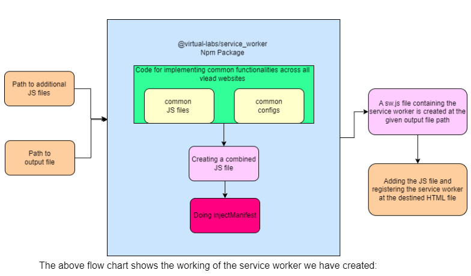

## Overview
Service worker acts as middleware between our app and the web browser. Service workers are scripts that run in the background of a web page, independent of the main thread. One of the primary purposes of service workers is to enable offline functionality by caching resources.They enable web applications to send push notifications to users' devices, keeping them engaged. Service workers facilitate background synchronization, ensuring that data is updated even when the user is not actively using the app. To use these features without much hassle we have used google-workbox and have created a wrapper over it to so that:
1. The service worker is designed in such a way it is easy to integrate with the different websites and it is modular and scalable.
2. Also in future there will be many projects that will use service worker, along with that some websites want some feature and other want something else. Therefore our service worker is highly extendible.
3. Considering the fact that the experiments build are mostly static and lightweight, we have a common functionality of caching and other functionality can be added by the user based on their need.
## Design



## User Guide
### 1. Experiments
- For experiments, the service worker package is integrated with build script. This provides some functionalities by default such as precaching, runtime caching of images and page styles and scripts.
- In order to add additional features provided by the service worker, following steps are required:
	1. Create a single js file which contains the implementation of all the additional features. Refer to the Google Workbox documentation for implementing the features.
	2. This file should be present inside your experiment directory.
	3. Inside your `experiment-descriptor.json` file, add property `service-worker` with the value as the path to the file you just created.
	4. Build your experment as usual to view the changes.

## Developer Guide
### 1. NPM package
- The current service worker package provided by Virtual Labs already consists of implementations of features such as precaching and runtime caching. These are present in `js/Template.js` file.
- The config file at `js/configTemplate.js` is the main configuration for running the workbox application which generates the servicie worker files to be used in applications. It consists of following properties:
    - `globDirectory`: The directory from which the files are to be cached.
	- `globPatterns`: The patterns of files to be cached.
	- `swDest`: The path where the service worker file will be generated.
	- `swSrc`: The path to the service worker template file.

### 2. Other Websites
- The service worker package can be used to generate the service worker files for other websites as well. For this, the following steps are required:
    1. Create a single js file which contains the implementation of all the additional features. Refer to the Google Workbox documentation for implementing the features.
    2. Call the `generateSW` function in main.js file with the following parameters:
        - `inputFilePath`: The path to the file created in step 1.
        - `buildPath`: The path to the build directory of your website.
        - `swDest`: The path where the service worker file will be generated.
    4. The service worker file will be generated at the path specified by `swDest` parameter. This file should be included in your website.
    5. The service worker file should be registered in your website. This can be done by adding the following code in your website:
        ```javascript
        if ('serviceWorker' in navigator) {
            window.addEventListener('load', function() {
                navigator.serviceWorker.register('service-worker.js');
            });
        }
        ```
        
    6. Build your website to view the changes.

## Link to Google-Workbox documentation
https://developer.chrome.com/docs/workbox